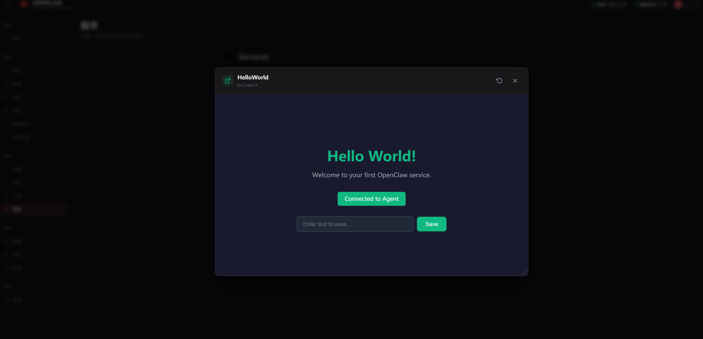
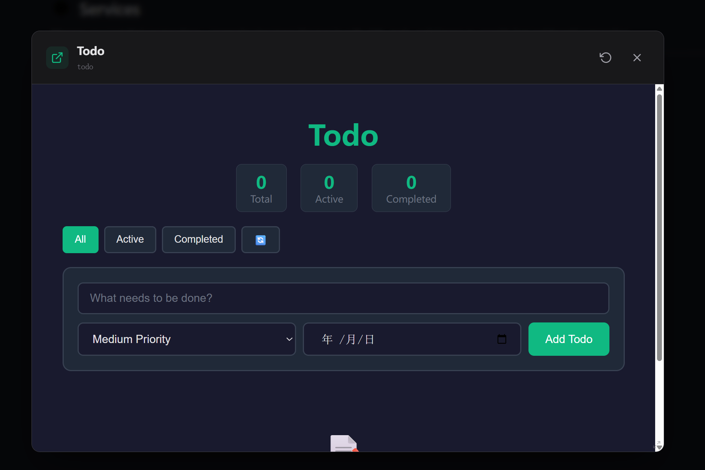

# 🦞 ServiceClaw —— 基于服务的 AI Agent 平台

<p align="center">
  <strong>长期运行服务 · 双向通信 · 有状态智能</strong>
</p>

<p align="center">
  <a href="LICENSE"></a>
</p>

**ServiceClaw** 是一个基于**服务通信协议（SCP）**的 AI Agent 平台。与传统的一次性函数调用技能（Skills）不同，服务（Services）是长期运行的组件，能够保持状态、提供自定义 UI，并与 Agent 进行双向通信。

> **与 OpenClaw 的关系**：ServiceClaw 是 [OpenClaw](https://github.com/openclaw/openclaw) 的一个分支，将**以技能为中心的模型**替换为**以服务为中心的架构**。OpenClaw 专注于短期工具调用，而 ServiceClaw 将服务视为一等公民——持久化、有状态且可交互。

> **我们的愿景**：ServiceClaw 的最终目的是完成一个轻量化的插件式服务，同时 ServiceClaw 将具备服务自建能力，根据你的需要随时构建一个页面精美、功能丰富的服务。

---

## 什么是服务？

ServiceClaw 中的**服务**是一个长期运行的组件，可以：

| 能力                | 描述                                      |
| ------------------- | ----------------------------------------- |
| 🖥️ **自定义 UI**    | 通过 `ui/` 提供专门的 WebView 模态框      |
| 🔄 **双向通信**     | 通过 SCP 与 Agent 进行实时 WebSocket 通信 |
| ⏰ **定时任务**     | 执行基于 cron 的后台作业                  |
| 📡 **Webhook 事件** | 监听和处理外部 HTTP 回调                  |
| 💬 **消息通道**     | 订阅并在消息通道上响应                    |
| 💾 **有状态**       | 在交互过程中保持状态（启用/禁用/运行中）  |

### 服务 vs 技能

| 特性         | 服务                   | 技能          |
| ------------ | ---------------------- | ------------- |
| **运行时**   | 长期运行的进程         | 短期函数执行  |
| **UI**       | 拥有独立的模态框       | 无独立 UI     |
| **通信**     | 双向 WebSocket（SCP）  | 单向请求-响应 |
| **触发方式** | 用户启动 / 定时 / 事件 | 工具调用      |
| **状态**     | 有状态                 | 无状态        |

### 服务示例




---

## 快速开始

### 1. 安装 ServiceClaw（本地构建）

```bash
git clone https://github.com/serviceclaw/serviceclaw.git
cd serviceclaw

pnpm install
pnpm build

# CLI 现已可在 ./dist/cli.js 使用
# 你可以全局链接或直接运行 ./dist/cli.js
pnpm link --global
```

### 2. 启动网关

```bash
serviceclaw gateway --port 18789 --verbose
```

### 3. 创建你的第一个服务

```bash
mkdir -p services/hello-service/{script,ui}
```

**`services/hello-service/manifest.json`：**

```json
{
  "id": "hello-service",
  "name": "Hello Service",
  "description": "一个简单的欢迎服务，演示 SCP 集成",
  "version": "1.0.0",
  "entry": "script/entry.ts",
  "ui": {
    "entry": "ui/index.html"
  },
  "capabilities": {
    "network": true,
    "filesystem": true
  },
  "category": "custom"
}
```

**`services/hello-service/script/entry.ts`：**

```typescript
import { ServiceClient } from "@serviceclaw/service-sdk";

const SERVICE_ID = "hello-service";
const AGENT_URL = "ws://localhost:18789/__serviceclaw__/scp";

async function main() {
  const client = new ServiceClient(SERVICE_ID, {
    name: "Hello Service",
    version: "1.0.0",
  });

  client.on("connected", () => {
    console.log("[hello-service] 已连接到 Agent");
  });

  client.on("ui.event", async (event) => {
    console.log("[hello-service] UI 事件:", event.type);

    // 响应 UI
    client.emitEvent("ui.response", {
      messageId: event.messageId,
      payload: { status: "已接收", data: event.payload },
    });
  });

  await client.connect(AGENT_URL);
  console.log("[hello-service] 服务已启动");
}

main().catch(console.error);
```

### 4. 启用并运行

```bash
# 网关会自动发现 ./services/ 目录中的服务
serviceclaw services list

# 启用你的服务
serviceclaw services enable hello-service

# 打开服务 UI
serviceclaw services run hello-service
```

---

## 服务通信协议（SCP）

SCP 是 ServiceClaw 的核心——一个基于 WebSocket 的协议，实现服务与 Agent 之间的丰富双向通信。

### WebSocket 端点

```
ws://localhost:18789/__serviceclaw__/scp?serviceId={service-id}
```

### 消息类型

**服务 → Agent：**

```typescript
// 服务已启动
{ type: "service.started", payload: { name, version } }

// 服务已停止
{ type: "service.stopped", payload: { reason } }

// 服务事件（发送给 UI 或 Agent）
{ type: "service.event", payload: { event, data } }

// 动作请求
{ type: "service.action", requestId, payload: { action, params } }
```

**Agent → 服务：**

```typescript
// Agent 响应
{ type: "agent.response", requestId, payload: { success, data, error } }

// 停止请求
{ type: "agent.stop-request", payload: { reason, force } }

// UI 事件（从 UI postMessage 转发）
{ type: "ui.event", payload: { type, messageId, payload } }
```

---

## 服务架构

```
┌─────────────────────────────────────────────────────────────┐
│                      ServiceClaw 网关                       │
│                    （控制平面 + SCP 服务器）                 │
└──────────────┬──────────────────────────────────────────────┘
               │
    ┌──────────┴──────────┐
    ▼                     ▼
┌─────────┐         ┌──────────┐
│  服务   │◄───────►│   Agent  │
│  (SCP)  │ WebSocket         │
└────┬────┘         └──────────┘
     │
     ▼
┌─────────┐
│   UI    │  （通过 /__serviceclaw__/services/ 的 iframe）
│(WebView)│
└─────────┘
```

### 核心组件

| 组件                        | 描述                                             |
| --------------------------- | ------------------------------------------------ |
| **ServiceRegistry**         | 管理服务状态（待处理/已安装/已启用/已禁用/错误） |
| **ServiceLifecycleManager** | 启动/停止/监控服务进程                           |
| **SCPServer**               | 实现 SCP 协议的 WebSocket 服务器                 |
| **ServiceModal**            | 基于 Lit 的 `<service-modal>` 组件，用于托管 UI  |
| **LifecycleSyncManager**    | 将模态框状态与服务生命周期同步                   |

---

## 服务生命周期

```
                    ┌─────────────┐
                    │   pending   │
                    └──────┬──────┘
                           │ 安装/验证
                           ▼
                    ┌─────────────┐
       ┌────────────│  validating │────────────┐
       │            └──────┬──────┘            │
       │ 验证失败          │ 验证通过          │
       ▼                   ▼                   │
┌─────────────┐    ┌─────────────┐            │
│validation_  │    │  installed  │            │
│   error     │    └──────┬──────┘            │
└─────────────┘           │                   │
                          │ 启用              │
                          ▼                   │
                   ┌─────────────┐           │
          ┌───────│   enabled   │───────┐  │
          │       └──────┬──────┘       │  │
          │ 禁用         │ 启动          │  │
          ▼              ▼              │  │
   ┌─────────────┐  ┌─────────────┐    │  │
   │   disabled  │  │   running   │────┘  │
   └─────────────┘  └──────┬──────┘       │
                           │ 错误         │
                           ▼              │
                    ┌─────────────┐      │
                    │    error    │──────┘
                    └─────────────┘
```

---

## 服务能力

在 `manifest.json` 中定义你的服务可以做什么：

```json
{
  "capabilities": {
    "network": true, // 网络访问
    "filesystem": true, // 文件系统访问
    "shell": true, // 执行 shell 命令
    "browser": true, // 浏览器自动化
    "webhook": true, // 接收 webhooks
    "cron": true, // 定时任务
    "message": true, // 消息通道访问
    "web": true, // Web UI 服务
    "privilegedTools": [], // 特权工具名称
    "requiresConfirmation": [] // 需要确认的工具
  }
}
```

### 触发器类型

```json
// Cron 定时触发器
{
  "trigger": {
    "type": "cron",
    "schedule": "0 */6 * * *",
    "timezone": "America/New_York"
  }
}

// Webhook 触发器
{
  "trigger": {
    "type": "webhook",
    "path": "/my-webhook",
    "methods": ["POST"]
  }
}

// 消息触发器
{
  "trigger": {
    "type": "message",
    "channels": ["telegram", "discord"],
    "filters": {
      "keywords": ["todo", "task"]
    }
  }
}
```

---

## UI 集成

服务可以提供丰富的 UI，与后端进行双向通信：

### UI → 服务

```javascript
// 在你的服务 UI 中（ui/index.html）
window.parent.postMessage(
  {
    source: "my-service-ui",
    type: "save",
    messageId: generateId(),
    payload: { content: "用户输入" },
  },
  "*",
);
```

### 服务 → UI

```typescript
// 在你的服务脚本中
client.emitEvent("ui.response", {
  type: "save.result",
  payload: { success: true, path: "/data/file.txt" },
});
```

### 服务 API 代理

对于更简单的请求-响应模式，使用 HTTP API 代理：

```javascript
// UI 端
const response = await fetch("/__serviceclaw__/services/my-service/api/save", {
  method: "POST",
  headers: { "Content-Type": "application/json" },
  body: JSON.stringify({ params: { content } }),
});
```

```typescript
// 服务端
client.registerActionHandler("save", (params) => {
  const { content } = params;
  return saveToFile(content);
});
```

---

## 服务 SDK

### 安装

```bash
cd services/my-service
npm install @serviceclaw/service-sdk
```

### ServiceClient API

```typescript
const client = new ServiceClient(serviceId, {
  name: "My Service",
  version: "1.0.0",
  actionTimeout: 30000,
  reconnect: {
    enabled: true,
    maxRetries: 5,
    initialDelay: 1000,
    maxDelay: 16000,
  },
});

// 事件处理
client.on("connected", () => {});
client.on("disconnected", ({ code, reason }) => {});
client.on("stop-requested", ({ reason, force }) => {});
client.on("ui.event", (event) => {});

// 动作
await client.connect(url);
client.disconnect();
client.emitEvent(event, data);
const result = await client.callAction(action, params);
```

---

## 开发

### 从源码构建

```bash
git clone https://github.com/serviceclaw/serviceclaw.git
cd serviceclaw

pnpm install
pnpm build

# 使用服务目录运行
serviceclaw gateway --services ./services
```

### 服务开发模式

```bash
# 变更时自动重载服务
serviceclaw services dev hello-service

# 查看服务日志
serviceclaw services logs hello-service --follow
```

---

## 示例

### HelloWorld 服务

一个具有文件持久化的最小完整服务：

```
examples/helloworld/
├── manifest.json
├── script/
│   └── entry.ts      # SCP 客户端 + 文件操作
└── ui/
    └── index.html    # 带有 postMessage 的样式化 UI
```

查看 [HelloWorld 示例](docs/services/helloworld-example.md) 获取完整代码。

### 配置向导

复杂的多步骤配置，包含表单验证：

- 带有表单组件的自定义 UI
- 通过 `service.action` 调用进行验证
- 通过 Agent 存储持久化设置

### 监控仪表板

实时数据显示服务：

- 从服务到 UI 的 WebSocket 推送
- 后台数据收集
- 通过 cron 触发器定时刷新

---

## 配置

### 最小配置

```json
{
  "agent": {
    "model": "anthropic/claude-opus-4-6"
  },
  "services": {
    "directory": "./services",
    "autoEnable": false
  }
}
```

### 服务发现

服务从配置的目录中自动发现：

```bash
~/.serviceclaw/services/     # 用户服务
./services/                   # 工作区服务（优先）
```

---

## 文档

- [服务开发指南](docs/services/agent-development-guide.md) —— 构建服务的完整指南
- [SCP 协议参考](docs/services/scp-protocol.md) —— 消息类型和通信模式
- [服务 SDK API](docs/services/sdk-api.md) —— ServiceClient 参考
- [UI 集成](docs/services/ui-integration.md) —— 构建服务 UI
- [API 代理](docs/services/api-proxy.md) —— 服务动作的 HTTP 代理
- [示例](docs/services/examples.md) —— 示例服务和模式

---

## 贡献

查看 [CONTRIBUTING.md](CONTRIBUTING.md) 了解贡献指南。

---

## 许可证

MIT 许可证 —— 详见 [LICENSE](LICENSE)。

---

## 致谢

ServiceClaw 建立在 [OpenClaw](https://github.com/openclaw/openclaw) 的基础之上，由 Peter Steinberger 和 OpenClaw 社区开发。服务架构和 SCP 协议代表了从基于技能到基于服务的 AI Agent 交互的根本转变。

<p align="center">
  <strong>构建服务，而非仅仅是技能。</strong>
</p>
