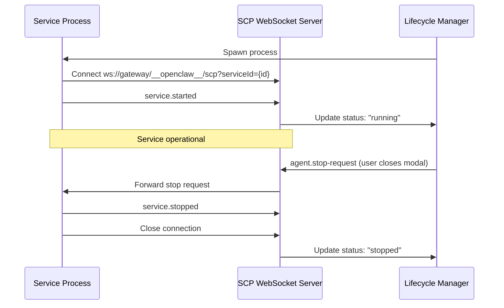
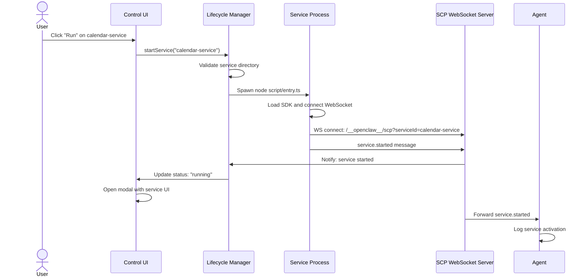
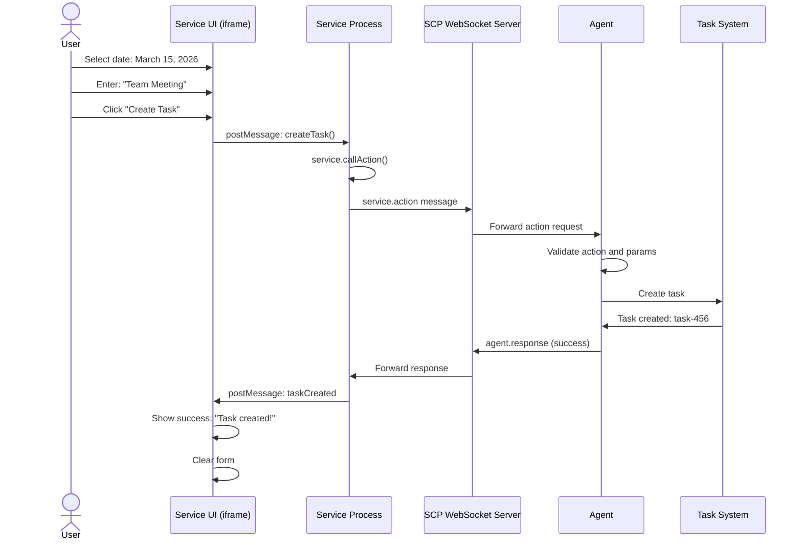
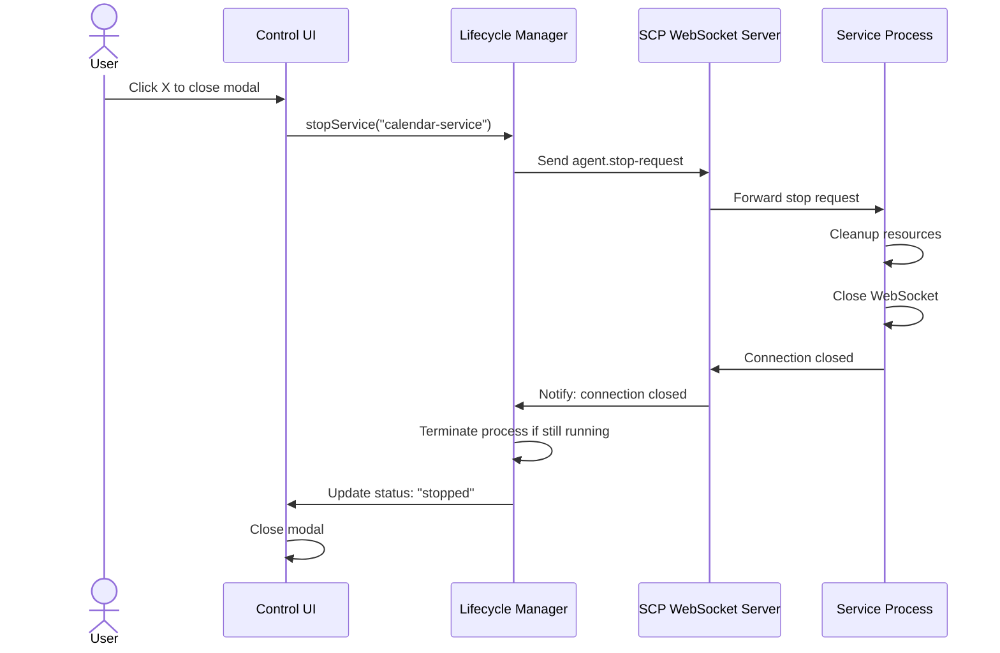
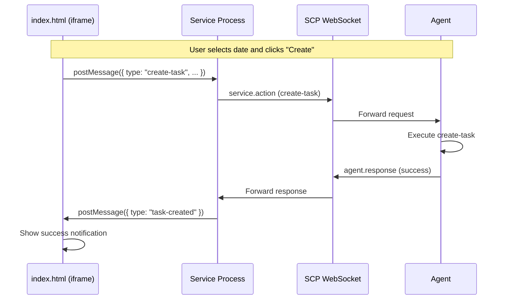

# SCP Protocol v1.0 Specification

**Service Communication Protocol (SCP)** is a bidirectional messaging protocol that enables communication between OpenClaw services and the Agent. It uses JSON-RPC style messages over WebSocket connections.

## Table of Contents

1. [Overview](#overview)
2. [Service Directory Structure](#service-directory-structure)
3. [Message Format](#message-format)
4. [Message Types](#message-types)
5. [WebSocket Connection Management](#websocket-connection-management)
6. [Error Codes](#error-codes)
7. [Interaction Flows](#interaction-flows)
8. [Example: Calendar Service](#example-calendar-service)

---

## Overview

SCP enables services running as separate processes to communicate with the OpenClaw Agent in real-time. The protocol supports:

- **Bidirectional communication**: Services can send events and request actions; the Agent can respond and request service termination
- **Request/response correlation**: All action requests include a `requestId` for matching responses
- **Type-safe messaging**: Well-defined message schemas for all communication patterns
- **Error handling**: Structured error responses with categorized error codes

### Transport

SCP uses **WebSocket** as its transport layer:

- **Endpoint**: `ws://gateway:18789/__openclaw__/scp?serviceId={serviceId}`
- **Encoding**: UTF-8 JSON messages
- **Connection**: One WebSocket per running service instance

---

## Service Directory Structure

Services are installed in `~/.openclaw/services/{service-name}/`:

```
~/.openclaw/services/{service-name}/
├── manifest.json          # Service metadata and configuration
├── script/
│   ├── entry.ts          # Service entry point (Node.js/TypeScript)
│   └── lib/              # Optional: Additional modules
└── ui/
    ├── index.html        # UI entry point
    ├── style.css         # Optional: Stylesheet
    └── app.js            # Optional: Frontend JavaScript
```

### manifest.json

```json
{
  "id": "calendar-service",
  "name": "Calendar Service",
  "version": "1.0.0",
  "description": "Calendar integration for task scheduling",
  "entry": "script/entry.ts",
  "ui": {
    "entry": "ui/index.html",
    "width": 400,
    "height": 600
  },
  "capabilities": ["tasks.create", "tasks.read"]
}
```

---

## Message Format

All SCP messages follow a JSON-RPC inspired format:

### Base Message Structure

```json
{
  "type": "message.type",
  "serviceId": "service-name",
  "timestamp": "2026-03-12T10:30:00.000Z"
}
```

### Request/Response Pattern

Action requests include a `requestId` for correlation:

**Request** (Service → Agent):

```json
{
  "type": "service.action",
  "serviceId": "calendar-service",
  "requestId": "req-123",
  "timestamp": "2026-03-12T10:30:00.000Z",
  "action": "create-task",
  "params": { "title": "Team Meeting" }
}
```

**Response** (Agent → Service):

```json
{
  "type": "agent.response",
  "serviceId": "calendar-service",
  "requestId": "req-123",
  "timestamp": "2026-03-12T10:30:00.500Z",
  "success": true,
  "data": { "taskId": "task-456" }
}
```

---

## Message Types

### service.started

**Direction**: Service → Agent

Sent by a service when it successfully starts and establishes its WebSocket connection.

```json
{
  "type": "service.started",
  "serviceId": "calendar-service",
  "timestamp": "2026-03-12T10:30:00.000Z",
  "version": "1.0.0",
  "capabilities": ["tasks.create", "tasks.read"]
}
```

| Field          | Type     | Description                              |
| -------------- | -------- | ---------------------------------------- |
| `type`         | string   | Fixed value: `"service.started"`         |
| `serviceId`    | string   | Unique service identifier                |
| `timestamp`    | string   | ISO 8601 timestamp                       |
| `version`      | string   | Service version from manifest            |
| `capabilities` | string[] | Optional: List of supported capabilities |

---

### service.stopped

**Direction**: Service → Agent

Sent by a service when it is shutting down gracefully.

```json
{
  "type": "service.stopped",
  "serviceId": "calendar-service",
  "timestamp": "2026-03-12T10:35:00.000Z",
  "reason": "user_request"
}
```

| Field       | Type   | Description                                                           |
| ----------- | ------ | --------------------------------------------------------------------- |
| `type`      | string | Fixed value: `"service.stopped"`                                      |
| `serviceId` | string | Unique service identifier                                             |
| `timestamp` | string | ISO 8601 timestamp                                                    |
| `reason`    | string | Optional: Shutdown reason (`"user_request"`, `"error"`, `"complete"`) |

---

### service.event

**Direction**: Service → Agent

Sent by a service to notify the Agent of user interactions or state changes.

```json
{
  "type": "service.event",
  "serviceId": "calendar-service",
  "timestamp": "2026-03-12T10:32:00.000Z",
  "event": "date.selected",
  "payload": {
    "date": "2026-03-15",
    "time": "14:00"
  }
}
```

| Field       | Type   | Description                    |
| ----------- | ------ | ------------------------------ |
| `type`      | string | Fixed value: `"service.event"` |
| `serviceId` | string | Unique service identifier      |
| `timestamp` | string | ISO 8601 timestamp             |
| `event`     | string | Event type identifier          |
| `payload`   | object | Event-specific data            |

---

### service.action

**Direction**: Service → Agent

Sent by a service to request the Agent perform an action (e.g., create a task, send a message).

```json
{
  "type": "service.action",
  "serviceId": "calendar-service",
  "requestId": "req-789",
  "timestamp": "2026-03-12T10:33:00.000Z",
  "action": "create-task",
  "params": {
    "title": "Team Meeting",
    "dueDate": "2026-03-15T14:00:00Z",
    "priority": "high"
  }
}
```

| Field       | Type   | Description                               |
| ----------- | ------ | ----------------------------------------- |
| `type`      | string | Fixed value: `"service.action"`           |
| `serviceId` | string | Unique service identifier                 |
| `requestId` | string | Unique request identifier for correlation |
| `timestamp` | string | ISO 8601 timestamp                        |
| `action`    | string | Action to perform                         |
| `params`    | object | Action parameters                         |

---

### agent.response

**Direction**: Agent → Service

Sent by the Agent in response to a `service.action` request.

**Success Response:**

```json
{
  "type": "agent.response",
  "serviceId": "calendar-service",
  "requestId": "req-789",
  "timestamp": "2026-03-12T10:33:00.500Z",
  "success": true,
  "data": {
    "taskId": "task-456",
    "title": "Team Meeting",
    "createdAt": "2026-03-12T10:33:00Z"
  }
}
```

**Error Response:**

```json
{
  "type": "agent.response",
  "serviceId": "calendar-service",
  "requestId": "req-789",
  "timestamp": "2026-03-12T10:33:00.500Z",
  "success": false,
  "error": {
    "code": 3001,
    "message": "Failed to create task: invalid date format",
    "details": {
      "field": "dueDate",
      "value": "invalid-date"
    }
  }
}
```

| Field       | Type    | Description                                 |
| ----------- | ------- | ------------------------------------------- |
| `type`      | string  | Fixed value: `"agent.response"`             |
| `serviceId` | string  | Unique service identifier                   |
| `requestId` | string  | Matches the original request ID             |
| `timestamp` | string  | ISO 8601 timestamp                          |
| `success`   | boolean | Whether the action succeeded                |
| `data`      | object  | Present if `success: true` - action result  |
| `error`     | object  | Present if `success: false` - error details |

#### Error Object

```typescript
{
  code: number;      // Error code (see Error Codes section)
  message: string;   // Human-readable error message
  details?: object;  // Optional: Additional error context
}
```

---

### agent.stop-request

**Direction**: Agent → Service

Sent by the Agent to request a service shut down gracefully.

```json
{
  "type": "agent.stop-request",
  "serviceId": "calendar-service",
  "timestamp": "2026-03-12T10:40:00.000Z",
  "reason": "modal_closed"
}
```

| Field       | Type   | Description                                                        |
| ----------- | ------ | ------------------------------------------------------------------ |
| `type`      | string | Fixed value: `"agent.stop-request"`                                |
| `serviceId` | string | Unique service identifier                                          |
| `timestamp` | string | ISO 8601 timestamp                                                 |
| `reason`    | string | Reason for stop request (`"modal_closed"`, `"error"`, `"timeout"`) |

The service should respond by closing its connection or sending a `service.stopped` message.

---

## WebSocket Connection Management

### Connection Lifecycle



### Connection Establishment

1. **Service Launch**: The Lifecycle Manager spawns the service process
2. **WebSocket Connect**: Service connects to `ws://{gateway}/__openclaw__/scp?serviceId={serviceId}`
3. **Handshake**: Service sends `service.started` message
4. **Confirmation**: Agent acknowledges and marks service as "running"

### Connection Termination

Services can disconnect in several ways:

| Scenario           | Behavior                                                                        |
| ------------------ | ------------------------------------------------------------------------------- |
| Graceful shutdown  | Service sends `service.stopped`, then closes connection                         |
| Agent stop request | Agent sends `agent.stop-request`, service should respond with `service.stopped` |
| Process crash      | Connection drops, Agent detects and cleans up                                   |
| Timeout            | Connection idle for configured period, Agent closes connection                  |

### Reconnection

Services **do not** automatically reconnect. If the connection drops unexpectedly:

1. The Lifecycle Manager detects the disconnection
2. Service state is marked as "error"
3. User must manually restart the service via the UI

---

## Error Codes

SCP uses numeric error codes organized into four categories:

| Range     | Category | Description                                             |
| --------- | -------- | ------------------------------------------------------- |
| 1000-1999 | Protocol | WebSocket, message format, and connection errors        |
| 2000-2999 | Service  | Service internal errors (entry script, UI errors)       |
| 3000-3999 | Agent    | Agent processing errors (action execution, permissions) |
| 4000-4999 | System   | System-level errors (process management, file system)   |

### Protocol Errors (1000-1999)

| Code | Name                     | Description                                     |
| ---- | ------------------------ | ----------------------------------------------- |
| 1000 | `CONNECTION_FAILED`      | WebSocket connection failed                     |
| 1001 | `CONNECTION_TIMEOUT`     | Connection timed out                            |
| 1002 | `INVALID_MESSAGE`        | Message format invalid (malformed JSON)         |
| 1003 | `UNKNOWN_MESSAGE_TYPE`   | Unknown message type received                   |
| 1004 | `MISSING_REQUIRED_FIELD` | Required field missing in message               |
| 1005 | `INVALID_FIELD_TYPE`     | Field type does not match schema                |
| 1006 | `SERVICE_ID_MISMATCH`    | Service ID in message does not match connection |
| 1007 | `REQUEST_ID_MISSING`     | Request ID required but not provided            |

### Service Errors (2000-2999)

| Code | Name                       | Description                                         |
| ---- | -------------------------- | --------------------------------------------------- |
| 2000 | `SERVICE_NOT_FOUND`        | Service not found in registry                       |
| 2001 | `ENTRY_NOT_FOUND`          | Entry script file not found                         |
| 2002 | `SERVICE_START_FAILED`     | Service failed to start                             |
| 2003 | `SERVICE_RUNTIME_ERROR`    | Runtime error in service code                       |
| 2004 | `UI_NOT_FOUND`             | UI entry file not found                             |
| 2005 | `INVALID_MANIFEST`         | manifest.json is invalid or missing required fields |
| 2006 | `CAPABILITY_NOT_SUPPORTED` | Service does not support requested capability       |

### Agent Errors (3000-3999)

| Code | Name                | Description                              |
| ---- | ------------------- | ---------------------------------------- |
| 3000 | `ACTION_NOT_FOUND`  | Requested action does not exist          |
| 3001 | `ACTION_FAILED`     | Action execution failed                  |
| 3002 | `INVALID_PARAMS`    | Action parameters invalid                |
| 3003 | `PERMISSION_DENIED` | Service lacks permission for action      |
| 3004 | `TIMEOUT`           | Action execution timed out               |
| 3005 | `AGENT_BUSY`        | Agent is busy and cannot process request |
| 3006 | `RATE_LIMITED`      | Too many requests from service           |

### System Errors (4000-4999)

| Code | Name                   | Description                         |
| ---- | ---------------------- | ----------------------------------- |
| 4000 | `PROCESS_SPAWN_FAILED` | Failed to spawn service process     |
| 4001 | `PROCESS_KILL_FAILED`  | Failed to terminate service process |
| 4002 | `FILESYSTEM_ERROR`     | File system operation failed        |
| 4003 | `RESOURCE_EXHAUSTED`   | System resources exhausted          |
| 4004 | `NETWORK_ERROR`        | Network communication error         |

### Error Message Format

All error responses follow this structure:

```json
{
  "type": "agent.response",
  "serviceId": "calendar-service",
  "requestId": "req-123",
  "success": false,
  "error": {
    "code": 3001,
    "message": "Failed to create task: database connection lost",
    "details": {
      "action": "create-task",
      "taskTitle": "Team Meeting",
      "retryable": true
    }
  }
}
```

| Field     | Type   | Description                                    |
| --------- | ------ | ---------------------------------------------- |
| `code`    | number | Numeric error code                             |
| `message` | string | Human-readable error description               |
| `details` | object | Optional: Contextual information for debugging |

---

## Interaction Flows

### 1. Service Startup Flow

This flow shows what happens when a user clicks "Run" on a service card.



**Flow Steps:**

1. User clicks the "Run" button in the Control UI
2. UI calls `startService()` on the Lifecycle Manager
3. Lifecycle Manager validates the service directory structure
4. Process supervisor spawns the service entry script
5. Service initializes and connects to the SCP WebSocket endpoint
6. Service sends `service.started` message
7. WebSocket server notifies Lifecycle Manager
8. UI updates the service card status and opens the modal
9. Agent logs the service activation for tracking

---

### 2. Create Task Action Flow

This flow demonstrates a service requesting the Agent to create a task.



**Message Exchange:**

**Step 5: Service sends action request**

```json
{
  "type": "service.action",
  "serviceId": "calendar-service",
  "requestId": "req-cal-001",
  "timestamp": "2026-03-12T10:33:00.000Z",
  "action": "create-task",
  "params": {
    "title": "Team Meeting",
    "dueDate": "2026-03-15T14:00:00Z",
    "description": "Weekly team sync"
  }
}
```

**Step 9: Agent sends success response**

```json
{
  "type": "agent.response",
  "serviceId": "calendar-service",
  "requestId": "req-cal-001",
  "timestamp": "2026-03-12T10:33:00.500Z",
  "success": true,
  "data": {
    "taskId": "task-456",
    "title": "Team Meeting",
    "createdAt": "2026-03-12T10:33:00Z",
    "url": "/tasks/task-456"
  }
}
```

---

### 3. Service Stop Flow

This flow shows the graceful shutdown sequence when the user closes the service modal.



**Step 3: Agent sends stop request**

```json
{
  "type": "agent.stop-request",
  "serviceId": "calendar-service",
  "timestamp": "2026-03-12T10:40:00.000Z",
  "reason": "modal_closed"
}
```

**Step 5: Service closes gracefully**

```json
{
  "type": "service.stopped",
  "serviceId": "calendar-service",
  "timestamp": "2026-03-12T10:40:01.000Z",
  "reason": "user_request"
}
```

---

## Example: Calendar Service

The Calendar Service demonstrates a complete SCP implementation. It provides a date picker UI that allows users to create tasks in OpenClaw.

### Service Architecture

```
services/calendar-service/
├── manifest.json
├── script/
│   └── entry.ts          # SCP client implementation
└── ui/
    ├── index.html        # Calendar picker UI
    └── app.js            # UI logic and message passing
```

### Entry Script (entry.ts)

```typescript
import { ServiceClient } from "@openclaw/service-sdk";

const client = new ServiceClient({
  serviceId: "calendar-service",
  gatewayUrl: process.env.OPENCLAW_GATEWAY_URL,
});

// Connect and notify Agent
await client.connect();
await client.emit("service.started", {
  version: "1.0.0",
  capabilities: ["tasks.create"],
});

// Handle UI events from iframe
process.on("message", async (msg) => {
  if (msg.type === "create-task") {
    try {
      const result = await client.callAction("create-task", {
        title: msg.title,
        dueDate: msg.dueDate,
      });

      // Notify UI of success
      process.send({ type: "task-created", taskId: result.taskId });
    } catch (error) {
      // Handle error - e.g., 3001 ACTION_FAILED
      process.send({ type: "error", message: error.message });
    }
  }
});

// Handle stop request from Agent
client.on("agent.stop-request", () => {
  // Cleanup
  await client.emit("service.stopped", { reason: "user_request" });
  await client.disconnect();
  process.exit(0);
});
```

### UI Communication Flow



### Event Flow Example

When the user interacts with the calendar:

**1. User selects a date:**

```javascript
// ui/app.js
calendar.on("select", (date) => {
  parent.postMessage(
    {
      type: "date-selected",
      date: date.toISOString(),
    },
    "*",
  );
});
```

**2. Service forwards as SCP event:**

```typescript
// script/entry.ts
window.on("message", (event) => {
  if (event.data.type === "date-selected") {
    client.emit("service.event", {
      event: "date.selected",
      payload: { date: event.data.date },
    });
  }
});
```

**3. Agent receives the event:**

```json
{
  "type": "service.event",
  "serviceId": "calendar-service",
  "timestamp": "2026-03-12T10:32:00.000Z",
  "event": "date.selected",
  "payload": {
    "date": "2026-03-15T00:00:00.000Z"
  }
}
```

---

## Appendix: TypeScript Types

```typescript
// Core message types
interface SCPMessage {
  type: string;
  serviceId: string;
  timestamp: string;
}

interface ServiceStartedMessage extends SCPMessage {
  type: "service.started";
  version: string;
  capabilities?: string[];
}

interface ServiceStoppedMessage extends SCPMessage {
  type: "service.stopped";
  reason?: string;
}

interface ServiceEventMessage extends SCPMessage {
  type: "service.event";
  event: string;
  payload: Record<string, unknown>;
}

interface ServiceActionMessage extends SCPMessage {
  type: "service.action";
  requestId: string;
  action: string;
  params: Record<string, unknown>;
}

interface AgentResponseMessage extends SCPMessage {
  type: "agent.response";
  requestId: string;
  success: boolean;
  data?: Record<string, unknown>;
  error?: SCPError;
}

interface AgentStopRequestMessage extends SCPMessage {
  type: "agent.stop-request";
  reason: string;
}

interface SCPError {
  code: number;
  message: string;
  details?: Record<string, unknown>;
}
```

---

## Version History

| Version | Date       | Changes               |
| ------- | ---------- | --------------------- |
| 1.0.0   | 2026-03-12 | Initial specification |

---

## References

- [OpenClaw Gateway Architecture](https://docs.openclaw.ai/concepts/architecture)
- [Service SDK Documentation](../packages/service-sdk/README.md)
- [Service Manifest Schema](../schemas/service-manifest.json)
