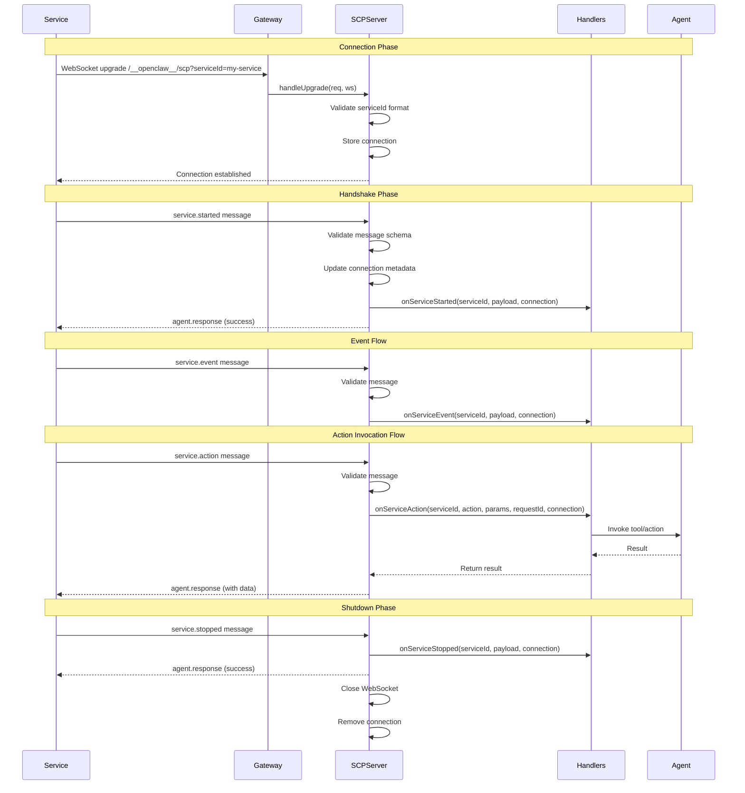

# SCP Architecture

> Comprehensive architecture document for the Service Communication Protocol (SCP) that powers OpenClaw Services.

---

## Architecture Overview

SCP (Service Communication Protocol) is the WebSocket-based communication layer that enables bidirectional messaging between OpenClaw Services and the Gateway. It provides a structured protocol for service registration, event emission, and action invocation.

### High-Level Component Diagram

```
┌─────────────────────────────────────────────────────────────────────────────┐
│                           OpenClaw System                                   │
├─────────────────────────────────────────────────────────────────────────────┤
│                                                                              │
│  ┌──────────────────┐         WebSocket          ┌──────────────────────┐   │
│  │                  │    ┌──────────────────┐    │                      │   │
│  │   Service        │◄──►│   Gateway HTTP   │◄──►│   SCP Server         │   │
│  │   (Client)       │    │   Server         │    │   (Message Handler)  │   │
│  │                  │    │                  │    │                      │   │
│  │  • Node.js/Bun   │    │  Port 18789      │    │  • Message parsing   │   │
│  │  • service-sdk   │    │  /__openclaw__/  │    │  • Validation        │   │
│  │  • WebSocket     │    │  scp             │    │  • Handler dispatch  │   │
│  │    client        │    │                  │    │  • Connection mgmt   │   │
│  └──────────────────┘    └──────────────────┘    └──────────┬───────────┘   │
│                                                             │               │
│                                                             ▼               │
│                                                  ┌──────────────────────┐   │
│                                                  │   Gateway Handlers   │   │
│                                                  │                      │   │
│                                                  │  • onServiceStarted  │   │
│                                                  │  • onServiceStopped  │   │
│                                                  │  • onServiceEvent    │   │
│                                                  │  • onServiceAction   │   │
│                                                  └──────────┬───────────┘   │
│                                                             │               │
│                                                             ▼               │
│                                                  ┌──────────────────────┐   │
│                                                  │   Service Registry   │   │
│                                                  │   & Agent            │   │
│                                                  └──────────────────────┘   │
│                                                                              │
└─────────────────────────────────────────────────────────────────────────────┘
```

### Key Components

| Component               | Responsibility                                                                           | Location                               |
| ----------------------- | ---------------------------------------------------------------------------------------- | -------------------------------------- |
| **Service**             | WebSocket client that connects to Gateway and sends/receives SCP messages                | User-defined or `packages/service-sdk` |
| **Gateway HTTP Server** | Handles WebSocket upgrade requests and routes to SCP endpoint                            | `src/gateway/server-http.ts`           |
| **SCP Server**          | Manages WebSocket connections, parses messages, validates format, dispatches to handlers | `src/services/scp-server.ts`           |
| **Gateway Handlers**    | Implements business logic for each message type                                          | `src/gateway/scp-handlers.ts`          |
| **Service Registry**    | Tracks active services and their capabilities                                            | Runtime state in Gateway               |

---

## Gateway Integration

### WebSocket Upgrade Flow

When a Service wants to connect, it initiates a WebSocket upgrade request to the Gateway:

```
┌─────────┐                              ┌─────────────┐         ┌─────────────┐
│ Service │                              │ Gateway HTTP│         │ SCP Server  │
└────┬────┘                              └──────┬──────┘         └──────┬──────┘
     │                                          │                       │
     │ 1. HTTP GET /__openclaw__/scp            │                       │
     │    Connection: Upgrade                   │                       │
     │    Upgrade: websocket                    │                       │
     │    ?serviceId={serviceId}                │                       │
     │─────────────────────────────────────────▶│                       │
     │                                          │                       │
     │                                          │ 2. Validate path      │
     │                                          │    matches SCP_WS_PATH│
     │                                          │                       │
     │                                          │ 3. Extract serviceId  │
     │                                          │    from query params  │
     │                                          │                       │
     │                                          │ 4. Validate kebab-case│
     │                                          │    format             │
     │                                          │                       │
     │                                          │ 5. Check for existing │
     │                                          │    connection         │
     │                                          │                       │
     │ 6. Accept upgrade                        │                       │
     │◀─────────────────────────────────────────│                       │
     │                                          │                       │
     │ 7. WebSocket established                 │                       │
     │◄═══════════════════════════════════════▶│                       │
     │                                          │                       │
     │                                          │      8. handleUpgrade │
     │                                          │──────────────────────▶│
     │                                          │                       │
```

### Route Handling

The SCP endpoint is registered at a fixed path:

```typescript
// src/gateway/server-constants.ts
export const SCP_WS_PATH = "/__openclaw__/scp";
```

Services connect using this URL pattern:

```
ws://localhost:18789/__openclaw__/scp?serviceId={serviceId}
```

The Gateway HTTP server handles the upgrade in `attachGatewayUpgradeHandler`:

```typescript
// From src/gateway/server-http.ts
if (url.pathname === SCP_WS_PATH) {
  if (opts.scpServer) {
    const wss = new WebSocketServer({ noServer: true });
    wss.handleUpgrade(req, socket, head, (ws) => {
      ws.once("close", () => wss.close());
      opts.scpServer?.handleUpgrade(req, ws);
    });
    return;
  }
}
```

### How SCP Bypasses Gateway Protocol Validation

Unlike regular Gateway WebSocket connections that use the Gateway Protocol (with authentication and session management), SCP connections take a different path:

| Aspect              | Gateway Protocol          | SCP Protocol               |
| ------------------- | ------------------------- | -------------------------- |
| **Path**            | `/`                       | `/__openclaw__/scp`        |
| **Auth**            | Token/password required   | serviceId only             |
| **Validation**      | Full Gateway auth         | Kebab-case validation only |
| **Connection type** | Persistent client session | Service-to-Gateway bridge  |
| **Message format**  | JSON-RPC                  | SCP message types          |

SCP connections bypass the standard Gateway authentication because:

1. Services run locally on the same machine as the Gateway
2. The `serviceId` acts as both identity and capability declaration
3. Service connections are treated as trusted infrastructure components

### Connection State Management

The SCP Server maintains connection state:

```typescript
// From src/services/scp-server.ts
type ServiceConnection = {
  serviceId: ServiceId; // Unique service identifier
  socket: WebSocket; // WebSocket instance
  connId: string; // UUID for this connection
  connectedAt: Date; // Connection timestamp
  metadata?: {
    // Populated after service.started
    name?: string;
    version?: string;
    actions?: string[];
  };
};
```

**Connection Lifecycle:**

1. **Connection** - WebSocket upgrade accepted, connection stored
2. **Handshake** - Service must send `service.started` within 30 seconds
3. **Active** - Bidirectional messaging enabled
4. **Disconnection** - Clean close or error triggers cleanup

---

## Message Flow

### Sequence Diagram: Complete Lifecycle



### 1. Service Connection

The Service initiates a WebSocket connection to the Gateway:

```javascript
// Example connection URL
const ws = new WebSocket("ws://localhost:18789/__openclaw__/scp?serviceId=todo-service");
```

### 2. service.started Handshake

Within 30 seconds of connecting, the Service must send a `service.started` message:

```json
{
  "type": "service.started",
  "serviceId": "todo-service",
  "requestId": "uuid-123",
  "timestamp": "2024-01-15T10:30:00Z",
  "payload": {
    "name": "Todo Service",
    "version": "1.0.0",
    "actions": ["add", "list", "complete"],
    "metadata": {
      "description": "Simple todo management"
    }
  }
}
```

The Gateway responds with:

```json
{
  "type": "agent.response",
  "serviceId": "todo-service",
  "requestId": "uuid-123",
  "timestamp": "2024-01-15T10:30:00Z",
  "payload": {
    "success": true
  }
}
```

### 3. Event Emission Flow

Services can emit events to the Gateway:

```json
{
  "type": "service.event",
  "serviceId": "todo-service",
  "requestId": "uuid-456",
  "timestamp": "2024-01-15T10:35:00Z",
  "payload": {
    "event": "task.completed",
    "data": {
      "taskId": "task-123",
      "completedAt": "2024-01-15T10:35:00Z"
    }
  }
}
```

Events do not receive a response (fire-and-forget).

### 4. Action Invocation Flow

Services can request actions from the Gateway:

```json
{
  "type": "service.action",
  "serviceId": "todo-service",
  "requestId": "uuid-789",
  "timestamp": "2024-01-15T10:40:00Z",
  "payload": {
    "action": "sendNotification",
    "params": {
      "message": "Task completed!",
      "channel": "telegram"
    },
    "timeout": 30000
  }
}
```

The Gateway processes the action and responds:

```json
{
  "type": "agent.response",
  "serviceId": "todo-service",
  "requestId": "uuid-789",
  "timestamp": "2024-01-15T10:40:01Z",
  "payload": {
    "success": true,
    "data": {
      "messageId": "msg-456"
    }
  }
}
```

### 5. Response Flow

All service messages (except events) receive an `agent.response`:

| Success Response | Error Response                     |
| ---------------- | ---------------------------------- |
| `success: true`  | `success: false`                   |
| `data: {...}`    | `error: {code, message, details?}` |

---

## Component Details

### SCPServer Responsibilities

The SCPServer (`src/services/scp-server.ts`) is the core message handling engine:

#### Message Validation

Every message is validated against Zod schemas:

```typescript
// Base message schema - all messages must include these fields
const SCPMessageBaseSchema = z.object({
  type: z.string(),
  serviceId: z.string().min(1, "serviceId is required"),
  requestId: z.string().min(1, "requestId is required"),
  timestamp: z.string().datetime(),
});

// Type-specific schemas extend the base
const ServiceStartedMessageSchema = SCPMessageBaseSchema.extend({
  type: z.literal("service.started"),
  payload: ServiceStartedPayloadSchema,
});
```

#### Supported Message Types

| Type                 | Direction         | Description                       |
| -------------------- | ----------------- | --------------------------------- |
| `service.started`    | Service → Gateway | Initial handshake with metadata   |
| `service.stopped`    | Service → Gateway | Graceful shutdown notification    |
| `service.event`      | Service → Gateway | Fire-and-forget event emission    |
| `service.action`     | Service → Gateway | Request Gateway to perform action |
| `agent.response`     | Gateway → Service | Response to service messages      |
| `agent.stop-request` | Gateway → Service | Request service to stop           |

#### Error Handling

The SCPServer uses standardized error codes:

```typescript
export const SCPErrorCodes = {
  // Connection errors (1000-1009)
  CONNECTION_FAILED: 1000,
  CONNECTION_TIMEOUT: 1001,
  INVALID_MESSAGE: 1002,
  UNKNOWN_MESSAGE_TYPE: 1003,
  MISSING_REQUIRED_FIELD: 1004,
  INVALID_FIELD_TYPE: 1005,
  SERVICE_ID_MISMATCH: 1006,
  REQUEST_ID_MISSING: 1007,

  // Service errors (2000-2999)
  SERVICE_NOT_FOUND: 2000,
  SERVICE_START_FAILED: 2002,
  SERVICE_RUNTIME_ERROR: 2003,

  // Action errors (3000-3999)
  ACTION_NOT_FOUND: 3000,
  ACTION_FAILED: 3001,
  INVALID_PARAMS: 3002,
  PERMISSION_DENIED: 3003,
  TIMEOUT: 3004,
  AGENT_BUSY: 3005,
  RATE_LIMITED: 3006,

  // Internal errors (4000-4999)
  PROCESS_SPAWN_FAILED: 4000,
  INTERNAL_ERROR: 4004,
} as const;
```

### Gateway Handlers

The Gateway implements handlers for each message type (`src/gateway/scp-handlers.ts`):

```typescript
export function createGatewaySCPServer(deps: GatewaySCPDeps): SCPServer {
  return createSCPServer({
    logger: deps.logger,

    onServiceStarted: (serviceId, payload, connection) => {
      // Register service in registry
      // Log service activation
    },

    onServiceStopped: (serviceId, payload, connection) => {
      // Clean up service resources
      // Log service deactivation
    },

    onServiceEvent: (serviceId, payload, connection) => {
      // Route event to appropriate handler
      // May trigger Agent wake or tool invocation
    },

    onServiceAction: async (serviceId, action, params, requestId, connection) => {
      // Execute requested action
      // Return result or throw error
    },

    onError: (serviceId, error, connection) => {
      // Log error details
      // May trigger alerts or recovery
    },

    onDisconnect: (serviceId, connection) => {
      // Clean up connection state
      // Mark service as offline
    },
  });
}
```

### Service Registry Integration

Active services are tracked in a registry:

```typescript
// Connection storage in SCPServer
const connections = new Map<ServiceId, ServiceConnection>();

// Stats available via
getConnectionStats: () => {
  const services = new Map<ServiceId, number>();
  for (const [serviceId] of connections) {
    services.set(serviceId, 1);
  }
  return {
    totalConnections: connections.size,
    services,
  };
};
```

### Message Validation

Strict validation ensures protocol integrity:

1. **JSON parsing** - Must be valid JSON
2. **Base schema** - Must include `type`, `serviceId`, `requestId`, `timestamp`
3. **Service ID match** - `serviceId` in message must match connection URL
4. **Type-specific schema** - Payload must match the declared type
5. **Handshake timeout** - `service.started` must arrive within 30 seconds

---

## Troubleshooting Guide

### Connection Refused Errors

**Symptom:** `WebSocket connection failed` or `ECONNREFUSED`

**Common Causes:**

1. **Gateway not running**

   ```bash
   # Check Gateway status
   openclaw gateway status

   # Start Gateway
   openclaw gateway --port 18789 --verbose
   ```

2. **Wrong port or host**

   ```javascript
   // Verify the URL
   const ws = new WebSocket("ws://localhost:18789/__openclaw__/scp?serviceId=my-service");
   ```

3. **Firewall blocking connection**
   - Ensure port 18789 is accessible locally
   - Check OS firewall settings

### 1008 Close Code Issues

**Symptom:** WebSocket closes with code `1008` (Policy Violation)

**Causes and Solutions:**

| Close Reason                  | Cause                            | Solution                                     |
| ----------------------------- | -------------------------------- | -------------------------------------------- |
| `Missing serviceId parameter` | URL missing `?serviceId=`        | Add serviceId query parameter                |
| `Invalid serviceId format`    | Service ID doesn't match pattern | Use kebab-case: `^[a-z0-9]+(?:-[a-z0-9]+)*$` |
| `Handshake timeout`           | No `service.started` within 30s  | Send handshake immediately after connect     |
| `New connection established`  | Duplicate serviceId connection   | Ensure only one instance runs                |

**Valid serviceId examples:**

- `todo-service`
- `my-service-v2`
- `github-webhook`

**Invalid serviceId examples:**

- `MyService` (uppercase)
- `my_service` (underscore)
- `-service` (starts with hyphen)
- `service--v2` (consecutive hyphens)

### serviceId Validation Failures

The serviceId must match this regex pattern:

```typescript
const serviceIdPattern = /^[a-z0-9]+(?:-[a-z0-9]+)*$/;
```

**Validation rules:**

- Lowercase letters and numbers only
- Hyphens allowed as separators
- Cannot start or end with hyphen
- No consecutive hyphens

### Message Timeout Issues

**Symptom:** Actions hang or return timeout errors

**Solutions:**

1. **Increase action timeout:**

   ```json
   {
     "type": "service.action",
     "payload": {
       "action": "slowOperation",
       "timeout": 60000 // 60 seconds
     }
   }
   ```

2. **Check Gateway logs:**

   ```bash
   openclaw gateway logs --follow
   ```

3. **Verify handler implementation:**
   - Ensure `onServiceAction` is implemented
   - Check for unhandled promise rejections

### Debug Logging Tips

Enable verbose logging to diagnose issues:

```bash
# Run Gateway with verbose output
openclaw gateway --verbose

# Or set environment variable
DEBUG=openclaw:* openclaw gateway
```

**Key log messages to watch for:**

| Log Message                      | Meaning                               |
| -------------------------------- | ------------------------------------- |
| `Service connected: {serviceId}` | Handshake successful                  |
| `Service started: {serviceId}`   | Service registered                    |
| `Invalid message structure`      | Schema validation failed              |
| `Service ID mismatch`            | serviceId in message differs from URL |
| `Handshake timeout`              | service.started not received in time  |
| `Unknown message type`           | Invalid `type` field in message       |

**Enable SCP-specific debug logging:**

```typescript
// In your service
const logger = {
  debug: (msg) => console.log(`[DEBUG] ${msg}`),
  info: (msg) => console.log(`[INFO] ${msg}`),
  warn: (msg) => console.log(`[WARN] ${msg}`),
  error: (msg) => console.log(`[ERROR] ${msg}`),
};
```

### Common Error Codes Reference

| Code | Name                     | Typical Cause                 |
| ---- | ------------------------ | ----------------------------- |
| 1002 | `INVALID_MESSAGE`        | Malformed JSON                |
| 1003 | `UNKNOWN_MESSAGE_TYPE`   | Invalid `type` field          |
| 1004 | `MISSING_REQUIRED_FIELD` | Missing required fields       |
| 1005 | `INVALID_FIELD_TYPE`     | Wrong data type in field      |
| 1006 | `SERVICE_ID_MISMATCH`    | serviceId differs from URL    |
| 1008 | (WebSocket close)        | Validation failure            |
| 3000 | `ACTION_NOT_FOUND`       | Action handler not configured |
| 3001 | `ACTION_FAILED`          | Action threw exception        |
| 3004 | `TIMEOUT`                | Action exceeded timeout       |

---

## References

### Documentation Links

- [Service Development Guide](/services/development-guide) - Complete guide for building Services
- [Service API Reference](/services/api) - Manifest schema and type definitions
- [Service Architecture](/services/architecture) - High-level Service system design

### Example Services

- [todo-service example](https://github.com/openclaw/openclaw/tree/main/examples/todo-service) - Reference implementation
- [Service SDK package](https://github.com/openclaw/openclaw/tree/main/packages/service-sdk) - Client library

### Source Code References

| File                              | Purpose                  |
| --------------------------------- | ------------------------ |
| `src/services/scp-server.ts`      | SCPServer implementation |
| `src/gateway/scp-handlers.ts`     | Gateway message handlers |
| `src/gateway/server-http.ts`      | WebSocket routing        |
| `src/gateway/server-constants.ts` | SCP_WS_PATH constant     |
| `packages/service-sdk/src/`       | Service client SDK       |

### Related Protocols

- [Gateway Protocol](/concepts/architecture) - Standard Gateway WebSocket protocol
- [Canvas A2UI](/platforms/mac/canvas) - UI rendering protocol

---

## Appendix: Message Schema Reference

### service.started

```typescript
{
  type: "service.started",
  serviceId: string,           // Must match URL parameter
  requestId: string,           // UUID for this request
  timestamp: string,           // ISO 8601 datetime
  payload: {
    name: string,              // Display name
    version: string,           // Semantic version
    actions?: string[],        // Available actions
    metadata?: Record<string, unknown>  // Custom data
  }
}
```

### service.event

```typescript
{
  type: "service.event",
  serviceId: string,
  requestId: string,
  timestamp: string,
  payload: {
    event: string,             // Event name
    data: unknown              // Event payload
  }
}
```

### service.action

```typescript
{
  type: "service.action",
  serviceId: string,
  requestId: string,
  timestamp: string,
  payload: {
    action: string,            // Action name
    params: unknown,           // Action parameters
    timeout?: number           // Milliseconds (default: 30000)
  }
}
```

### agent.response

```typescript
{
  type: "agent.response",
  serviceId: string,
  requestId: string,           // Matches request being responded to
  timestamp: string,
  payload: {
    success: boolean,
    data?: unknown,            // Present if success=true
    error?: {                  // Present if success=false
      code: number,
      message: string,
      details?: Record<string, unknown>
    }
  }
}
```
